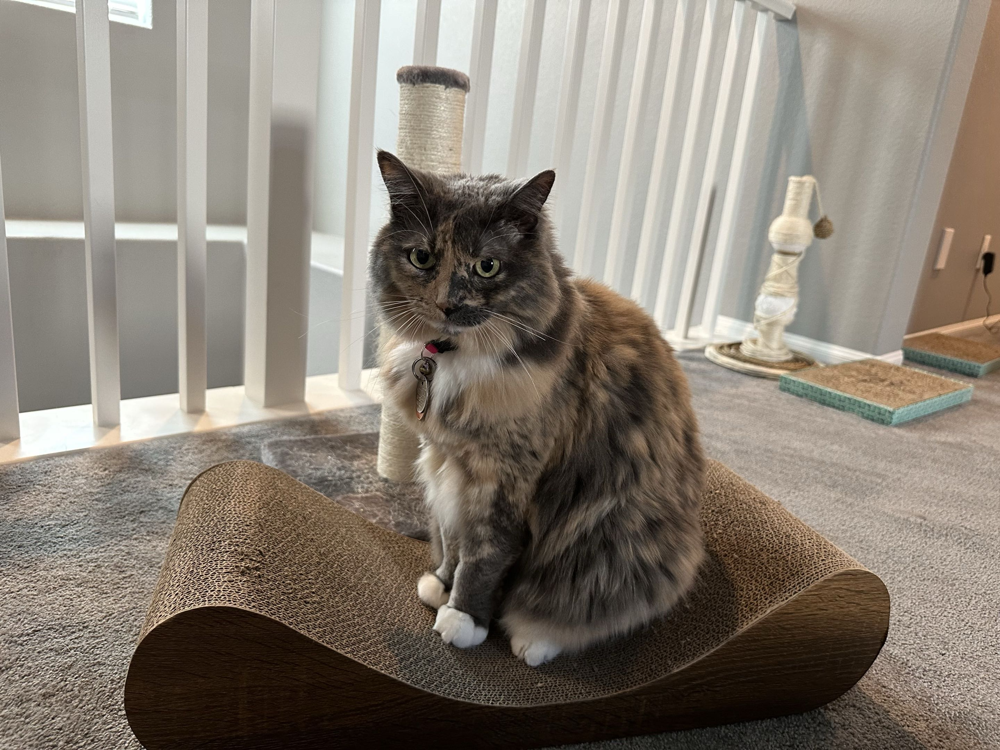

## Background

I was born and raised in Los Angeles, California. In my high school years, my family moved for my father's work to 
Seattle in Washington State. It was there I discovered my love for the Pacific Northwest - after a lifetime in the California sun,
I found I loved the rain and the cold especially. Determined to never leave, I began international study at the University of British 
Columbia with the undergraduate program in Astronomy. With the completion of my degree, I decided to enter into UBC's Master of Data 
Science program as my last educational stop before hopefully entering career work in Vancouver.
 

{width=250px}

## Why Data Science?

During my time in my astronomy program, I came to realize just how much data astronomy uses - gigabytes of raw data for
even seemingly simple observations using UBC's comparatively small telescopes. I was taught the ways to navigate it for
our purposes within the astronomy program, but it got me curious about data as a whole. I was also influenced by the rise 
of AI - in the time between beginning and ending my program, I saw it go from a rough and flawed novelty to being the 
next big thing that has the potential to transform science - and at the root of AI is data. I was determined to catch
the rising wave that AI provided, and so I opted to enter into UBC's data science program to better prepare me for data not
only within the field of astronomy, but as a whole.

## Outside of Data Science...

For lack of better phrasing, I am a huge nerd. I love passtimes that put my mind to work - board games, trading-card games, 
video games, and in particular wargames. My time at UBC gave me a great opportunity to connect with people like me through 
clubs and events, and I spent a huge amount of my undergrad free time enjoying my hobbies with others. If it makes me think, 
I'll enjoy it - especially so with friends.