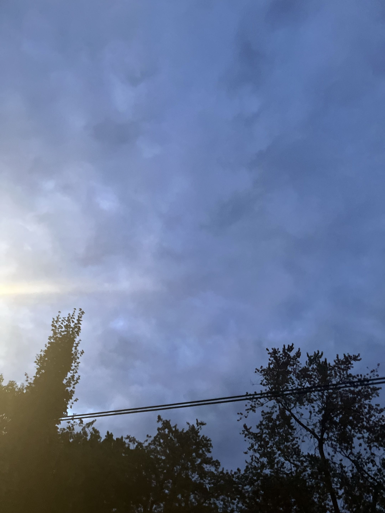

I'm feeling pretty good about my first few weeks of orentation. This blog post I'm writing right now actually constitutes 
a part of my last assignment that I'm working on for the week. What I'm still most anxious about are the quizzes to come 
next week, though being anxious about exams is nothing new for me.

The program has me thinking in a lot of new ways, especially as it concerns Python. In astronomy, my data processing and 
cleaning was generally a one-time affair, done for the purposes of a single assignment before moving on to the next - having 
to more seriously consider things such as processing speed, replicability and documentation is a change of pace from what 
I'm used to, though I'm keeping up.

I've met a lot of good people across my classes and labs, some with more experience than me and some with less - it was 
very interesting to me to see the proportion of people who are returning to school after working for long periods. Though 
I'm still pretty burnt out from the end of my undergrad, I figure it'll be much better for me to strike while the iron is 
still hot rather than to take a break and return to studies later in life. I'm looking forwards to the program as a whole!

